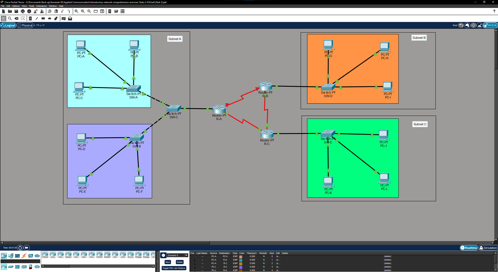

# Multi-Subnet Network Design

Three-subnet routed network built in Cisco Packet Tracer. 12 PCs across 3 subnets, 5 switches, 3 routers connected in a triangle over serial links. OSPF handles routing automatically, DHCP handles IP allocation on each subnet.

## Topology



R-A sits in the center and connects to both R-B and R-C via serial links. R-B serves Subnet B on the right, R-C serves Subnet C at the bottom right. Subnet A is the largest, with 6 PCs spread across 3 switches (SW-A, SW-B, SW-C) all feeding into R-A.

## IP Addressing

### Subnets

| Subnet | Network | PCs | Gateway (Router Interface) |
|--------|---------|-----|--------------------|
| Subnet A | 192.168.10.0/24 | PC-A, PC-B, PC-C, PC-D, PC-E, PC-F | 192.168.10.1, R-A Fa0/0 |
| Subnet B | 192.168.20.0/24 | PC-G, PC-H, PC-I | 192.168.20.1, R-B Fa0/0 |
| Subnet C | 192.168.30.0/24 | PC-J, PC-K, PC-L | 192.168.30.1, R-C Fa0/0 |

/24 on each subnet gives 254 usable addresses, plenty of room for growth without changing the scheme later.

### Serial Interconnects

| Link | R-A Interface | Remote Interface | Network |
|------|--------------|-----------------|---------|
| R-A to R-B | Se2/0, 10.0.0.1 | Se2/0, 10.0.0.2 | 10.0.0.0/24 |
| R-A to R-C | Se3/0, 10.0.2.1 | Se3/0, 10.0.2.2 | 10.0.2.0/24 |

## Routing

All three routers run OSPF process 1, all in area 0. Each router advertises its directly connected networks and learns the rest from its neighbors automatically. No static routes.

```
router ospf 1
 network 192.168.10.0 0.0.0.255 area 0
 network 10.0.0.0 0.0.0.255 area 0
 network 10.0.2.0 0.0.0.255 area 0
```

The reason for OSPF over static routing is failover. If a link goes down, OSPF detects it and recalculates within seconds, rerouting traffic over the remaining path. With static routes that would require manual intervention.

## DHCP

Each router is the DHCP server for its own subnet. All PCs get their IP address, subnet mask, default gateway, and DNS server automatically on boot.

```
ip dhcp pool SubnetA
 network 192.168.10.0 255.255.255.0
 default-router 192.168.10.1
 dns-server 192.168.10.1
```

## Simulation Tests

### Normal routing, PC-A to PC-H

```
PC-A -> SW-A -> SW-C -> R-A -> R-B -> SW-D -> PC-H
```

Packet followed the shortest OSPF path, delivered successfully.

### Failover test, R-A to R-B link disabled

Disabled the serial link between R-A and R-B. OSPF recalculated and rerouted:

```
PC-A -> R-A -> R-C -> R-B -> PC-H
```

No config changes. Traffic rerouted automatically, connection restored.

## Notes

Give the network a few seconds after first boot before testing. OSPF and DHCP both need time to converge and if you ping immediately after starting the simulation, the first few packets will fail. Static IPs on critical devices would avoid this.

There are no redundant physical links between routers. OSPF can handle a single link failure but not two at once. That, along with the lack of traffic segmentation within each subnet, are the main limitations. VLANs address the segmentation issue and are implemented in the Task 3 build.

## Files

| File | Description |
|------|-------------|
| topology.pkt | Cisco Packet Tracer simulation |
| ip-addressing.xlsx | IP allocation spreadsheet |
| configs/Router-A.txt | R-A config, OSPF + DHCP for Subnet A |
| configs/Router-B.txt | R-B config |
| configs/Router-C.txt | R-C config |
| configs/switches/ | SW-A through SW-E configs |
