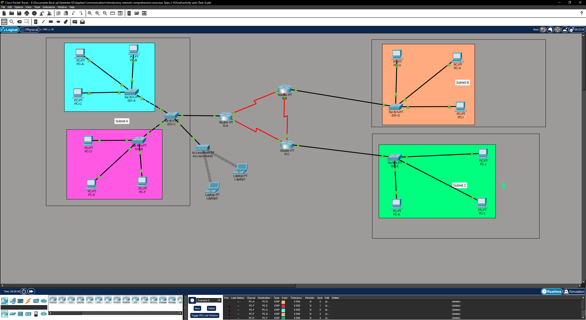

# Task 3 - VLAN Implementation

Extends the Task 2 topology with three VLANs and a Router-on-a-Stick setup for inter-VLAN routing. Also adds a wireless access point on a dedicated VLAN for laptop connectivity.

## Topology



## Subnetting

The original /24 was split to give each VLAN its own range:

```
192.168.1.0/24
  192.168.1.0/25      VLAN 225   (Wi-Fi)      .1 to .126
  192.168.1.128/25
    192.168.1.128/26  VLAN 75    (Group A)    .129 to .190
    192.168.1.192/26  VLAN 150   (Group B)    .193 to .254
```

## VLANs

| VLAN | ID | Subnet | Sub-interface | Devices |
|------|----|--------|---------------|---------|
| VLAN 75 | 75 | 192.168.1.128/26 | Fa0/0.75 | PC-A, PC-D, PC-F |
| VLAN 150 | 150 | 192.168.1.192/26 | Fa0/0.150 | Remaining PCs |
| VLAN 225 | 225 | 192.168.1.0/25 | Fa0/0.225 | Laptops via AP |

## Router-on-a-Stick

Router A handles all inter-VLAN routing on a single physical interface. Each VLAN gets its own sub-interface with 802.1Q encapsulation.

```
FastEthernet0/0
  Fa0/0.75   encapsulation dot1Q 75    ip 192.168.1.129 /26
  Fa0/0.150  encapsulation dot1Q 150   ip 192.168.1.193 /26
  Fa0/0.225  encapsulation dot1Q 225   ip 192.168.1.1   /25
```

All three sub-interfaces came up as up/up in simulation.

## Switches

Each switch has access ports (one VLAN per port for end devices) and trunk ports toward Router A that carry tagged traffic for all three VLANs.

## DHCP

Router A is the DHCP server for all VLANs. The first few addresses in each range are excluded for static assignment:

```
ip dhcp excluded-address 192.168.1.1   192.168.1.10
ip dhcp excluded-address 192.168.1.129 192.168.1.139
ip dhcp excluded-address 192.168.1.193 192.168.1.200
```

## Wireless

The access point is on VLAN 225 with SSID `VLAN 225 Wi-Fi` and WPA-PSK. Laptops connect wirelessly, get a DHCP address from the VLAN 225 pool, and can reach other VLANs through Router A.

## Connectivity Tests

Intra-VLAN (PC-A to PC-D, same VLAN 75): working.  
Inter-VLAN (PC-A to VLAN 150 and VLAN 225): working through Router A sub-interfaces.  
Interface toggle test: disabling a sub-interface isolated that VLAN, re-enabling restored it.

## Compared to Task 2

| | Task 2 | Task 3 |
|--|--------|--------|
| Segmentation | Subnet per router | VLAN per logical group |
| Routing | OSPF across 3 routers | Router-on-a-Stick on 1 router |
| Subnets | 3x /24 | 2x /26 + 1x /25 from one /24 |
| Wireless | None | VLAN 225 via AP |
| Broadcast domains | 1 per subnet | 1 per VLAN |

## Files

| File | Description |
|------|-------------|
| topology.pkt | Packet Tracer simulation |
| ip-addressing.xlsx | Subnetting and VLAN planning spreadsheet |
| configs/Router-A.txt | Router-on-a-Stick config with all sub-interfaces |
| configs/SW-A.txt | Switch A config |
| configs/SW-B.txt | Switch B config |
| configs/SW-C.txt | Switch C config |
